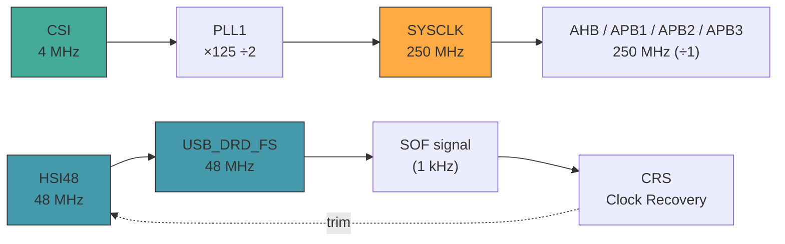
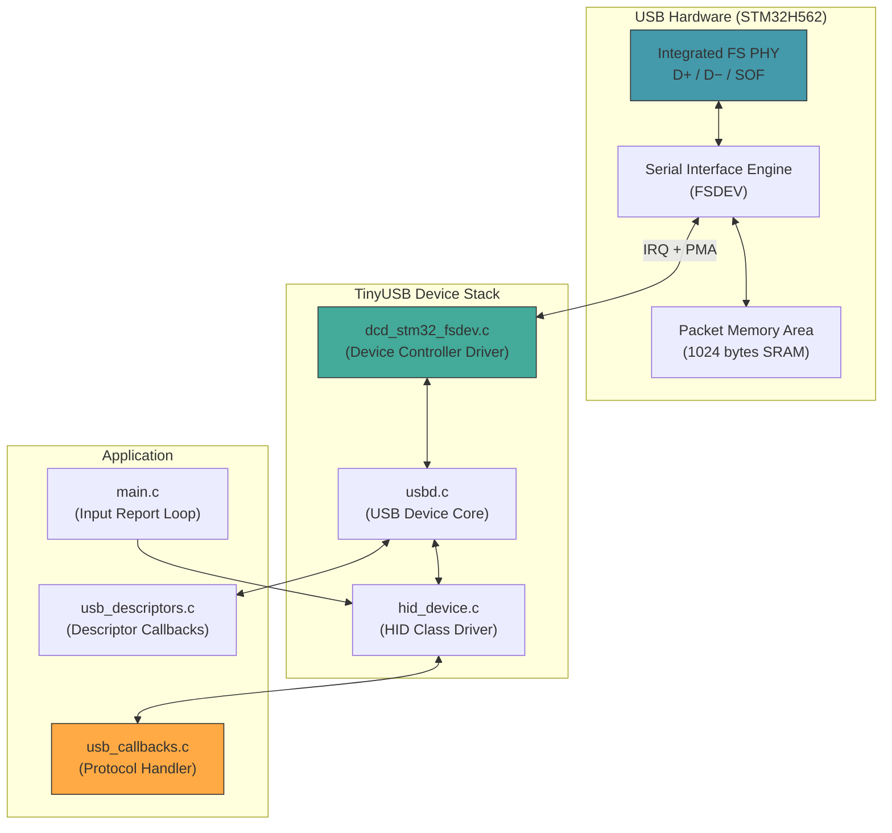
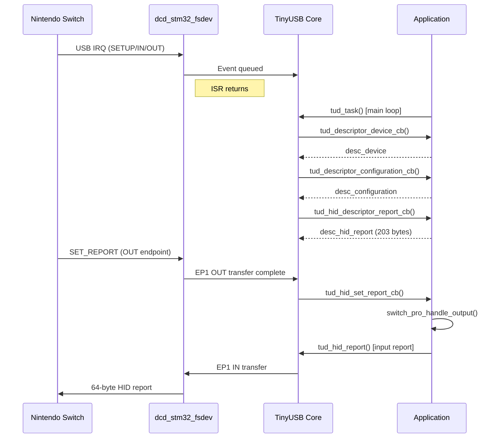
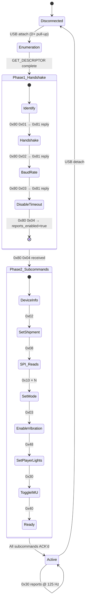
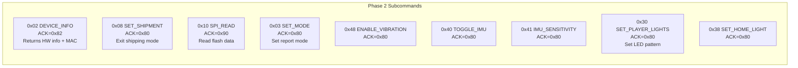
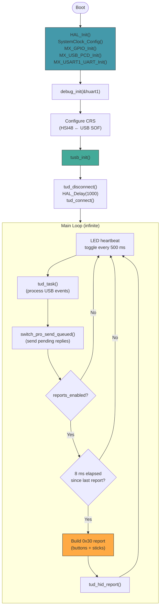

# Auto Switch Pro — Technical Reference

STM32H562RGT6-based Nintendo Switch Pro Controller emulator using TinyUSB.
Runs on the **WeAct STM32H5 CoreBoard V1.1** (LQFP-64 package).

---

## Table of Contents

1. [Hardware Platform](#1-hardware-platform)
2. [Clock Architecture](#2-clock-architecture)
3. [USB Physical Layer](#3-usb-physical-layer)
4. [TinyUSB Integration](#4-tinyusb-integration)
5. [USB Descriptor Stack](#5-usb-descriptor-stack)
6. [Nintendo Switch Pro Controller Protocol](#6-nintendo-switch-pro-controller-protocol)
7. [SPI Flash Emulation](#7-spi-flash-emulation)
8. [Input Report Format](#8-input-report-format)
9. [Main Loop Architecture](#9-main-loop-architecture)
10. [Debug Infrastructure](#10-debug-infrastructure)

---

## 1. Hardware Platform

| Parameter | Value |
|---|---|
| MCU | STM32H562RGT6 (Cortex-M33, 250 MHz) |
| Package | LQFP-64 |
| Flash | 1024 KB |
| RAM | 640 KB |
| Board | WeAct STM32H5 CoreBoard V1.1 |
| USB PHY | Integrated Full-Speed (12 Mbit/s) |
| USB Connector | USB-C (with 5.1 kΩ CC pull-downs on board) |

### Pin Assignments

| Pin | Function | Peripheral |
|---|---|---|
| PA8 | USB SOF | USB_DRD_FS (AF10) |
| PA11 | USB D− | USB_DRD_FS |
| PA12 | USB D+ | USB_DRD_FS |
| PB2 | LED | GPIO Output (push-pull, active-low) |
| PB14 | UART TX | USART1 (debug, 115200 8N1) |
| PB15 | UART RX | USART1 (debug, 115200 8N1) |
| PH0 | HSE In | RCC OSC_IN (not used for system clock) |
| PH1 | HSE Out | RCC OSC_OUT |

### Memory Layout (Linker Script)

```
MEMORY
{
  FLASH (rx)  : ORIGIN = 0x08000000, LENGTH = 1024K
  RAM   (xrw) : ORIGIN = 0x20000000, LENGTH = 640K
}

_Min_Stack_Size = 0x2000;  /* 8 KB — TinyUSB needs headroom */
_Min_Heap_Size  = 0x200;   /* 512 bytes */
```

The stack grows downward from the top of RAM (`0x200A0000`). 8 KB is required because TinyUSB's device stack and the Pro Controller protocol handler both use stack-allocated 64-byte buffers.

---

## 2. Clock Architecture

The system uses two independent oscillator domains: a high-speed PLL for the CPU and a dedicated 48 MHz source for USB.



### PLL1 Configuration (CPU Clock)

```c
RCC_OscInitStruct.OscillatorType = RCC_OSCILLATORTYPE_HSI48 | RCC_OSCILLATORTYPE_CSI;
RCC_OscInitStruct.CSIState       = RCC_CSI_ON;         // 4 MHz internal RC
RCC_OscInitStruct.PLL.PLLSource  = RCC_PLL1_SOURCE_CSI; // CSI → PLL1
RCC_OscInitStruct.PLL.PLLM       = 1;                   // ÷1 → 4 MHz VCO input
RCC_OscInitStruct.PLL.PLLN       = 125;                 // ×125 → 500 MHz VCO
RCC_OscInitStruct.PLL.PLLP       = 2;                   // ÷2 → 250 MHz SYSCLK
```

$f_{SYSCLK} = \frac{f_{CSI} \times PLLN}{PLLM \times PLLP} = \frac{4\text{ MHz} \times 125}{1 \times 2} = 250\text{ MHz}$

### USB Clock (HSI48 + CRS)

USB Full-Speed requires exactly 48.000 MHz ± 0.25%. The internal HSI48 RC oscillator is factory-trimmed but drifts with temperature. The **Clock Recovery System (CRS)** locks HSI48 to the 1 kHz USB SOF (Start-of-Frame) signal from the host:

```c
__HAL_RCC_CRS_CLK_ENABLE();
RCC_CRSInitTypeDef crs = {0};
crs.Source    = RCC_CRS_SYNC_SOURCE_USB;   // USB SOF as reference
crs.Prescaler = RCC_CRS_SYNC_DIV1;
crs.Polarity  = RCC_CRS_SYNC_POLARITY_RISING;
HAL_RCCEx_CRSConfig(&crs);
```

This eliminates the need for an external crystal on the USB clock path. The CRS performs continuous frequency adjustment every SOF period (1 ms), keeping HSI48 within the USB ±0.25% tolerance.

---

## 3. USB Physical Layer

### USB-C and Full-Speed Signaling

The STM32H562 has an integrated Full-Speed USB PHY with:
- Internal D+ pull-up resistor (controlled via `USB_BCDR_DPPU`)
- 3.3 V I/O levels on D+/D− (no external transceiver needed)
- Embedded DMA (PMA — Packet Memory Area) for endpoint buffers

The WeAct board provides:
- USB-C connector with **5.1 kΩ pull-downs on CC1/CC2** (identifies as UFP / device to any USB-C host or cable)
- No VBUS sensing — the board is always self-powered from USB-C

### FSDEV Driver Architecture

The STM32H5 uses the **FSDEV** (Full-Speed Device) USB peripheral — a register-compatible descendant of the STM32F0/L0/G0 USB IP. This is distinct from the OTG (Synopsys DWC2) peripheral found in STM32F4/F7/H7.



### Interrupt Routing

CubeMX generates the NVIC configuration, but TinyUSB handles the USB interrupt directly:

```c
// stm32h5xx_it.c
void USB_DRD_FS_IRQHandler(void) {
    tusb_int_handler(0, true);  // TinyUSB handles everything
    return;                     // Skip HAL_PCD_IRQHandler
    HAL_PCD_IRQHandler(&hpcd_USB_DRD_FS);  // unreachable (kept for CubeMX)
}
```

The `tusb_int_handler(0, true)` call processes all USB events (RESET, SETUP, EP transfers, SOF, SUSPEND) inside the `dcd_stm32_fsdev.c` driver, then returns. TinyUSB defers application-level processing to `tud_task()` in the main loop.

### Soft Reconnect Sequence

The STM32H5 boots in ~10 ms, much faster than the Switch dock's USB polling interval. Without a controlled reconnect, the dock may miss the initial D+ pull-up assertion:

```c
tusb_init();         // Enables D+ pull-up, host sees device attach
tud_disconnect();    // Removes D+ pull-up, host sees device detach
HAL_Delay(1000);     // Wait for host to process detach
tud_connect();       // Re-assert D+ pull-up, clean attach event
```

---

## 4. TinyUSB Integration

### Configuration (`tusb_config.h`)

```c
#define CFG_TUSB_MCU            OPT_MCU_STM32H5
#define CFG_TUSB_RHPORT0_MODE   OPT_MODE_DEVICE    // Device only
#define CFG_TUSB_OS             OPT_OS_NONE         // Bare-metal (no RTOS)
#define CFG_TUD_ENDPOINT0_SIZE  64                  // Required by Switch
#define CFG_TUD_HID             1                   // Single HID interface
#define CFG_TUD_HID_EP_BUFSIZE  64                  // 64-byte reports
```

Only the HID class is enabled. CDC, MSC, MIDI, and Vendor classes are disabled to minimize code size and eliminate unused endpoints.

### TinyUSB Callback Architecture

TinyUSB uses a callback-driven design. The application implements specific functions that TinyUSB calls:



### Descriptor Callbacks

| Callback | Returns | File |
|---|---|---|
| `tud_descriptor_device_cb()` | 18-byte device descriptor | `usb_descriptors.c` |
| `tud_descriptor_configuration_cb()` | 41-byte config descriptor | `usb_descriptors.c` |
| `tud_hid_descriptor_report_cb()` | 203-byte HID report descriptor | `usb_descriptors.c` |
| `tud_descriptor_string_cb()` | UTF-16 string descriptors | `usb_descriptors.c` |

### Event Callbacks

| Callback | Purpose | File |
|---|---|---|
| `tud_mount_cb()` | Reset protocol state on USB attach | `usb_callbacks.c` |
| `tud_umount_cb()` | Clear state on detach | `usb_callbacks.c` |
| `tud_hid_set_report_cb()` | Receive Switch commands (OUT EP) | `usb_callbacks.c` |
| `tud_hid_get_report_cb()` | Control pipe GET_REPORT (unused) | `usb_callbacks.c` |

---

## 5. USB Descriptor Stack

### Device Descriptor

```c
tusb_desc_device_t const desc_device = {
    .bcdUSB          = 0x0200,       // USB 2.0
    .bDeviceClass    = 0x00,         // Defined at interface level
    .bMaxPacketSize0 = 64,           // EP0 max packet
    .idVendor        = 0x057E,       // Nintendo Co., Ltd.
    .idProduct       = 0x2009,       // Pro Controller
    .bcdDevice       = 0x0210,       // FW revision 2.10
    .iManufacturer   = 0x01,         // "Nintendo Co., Ltd."
    .iProduct        = 0x02,         // "Pro Controller"
    .iSerialNumber   = 0x03,         // "000000000001"
};
```

The VID/PID `057E:2009` is **mandatory**. The Switch checks these values before initiating the Pro Controller handshake protocol. Any other VID/PID is treated as a generic USB device and rejected.

### Configuration Descriptor (41 bytes)

```
Config Descriptor         9 bytes
├─ Interface Descriptor   9 bytes  (HID class, 2 endpoints)
│  ├─ HID Descriptor      9 bytes  (HID 1.11, report desc = 203 bytes)
│  ├─ EP 0x81 IN          7 bytes  (Interrupt, 64 bytes, bInterval=8)
│  └─ EP 0x01 OUT         7 bytes  (Interrupt, 64 bytes, bInterval=8)
```

Key attributes:
- **`bmAttributes = 0xA0`** — Bus-powered with Remote Wakeup capability
- **`bMaxPower = 0xFA`** — 500 mA maximum (required for USB-powered controllers)
- **`bInterval = 8`** — Poll every 8 ms (125 Hz) for both IN and OUT endpoints

### HID Report Descriptor (203 bytes)

The HID report descriptor defines 6 report IDs across input and output pipes:

| Report ID | Direction | Size | Purpose |
|---|---|---|---|
| `0x30` | IN (Device → Host) | 64 bytes | Standard input report (buttons, sticks, IMU) |
| `0x21` | IN (Device → Host) | 64 bytes | Subcommand reply |
| `0x81` | IN (Device → Host) | 64 bytes | Config (0x80) command reply |
| `0x01` | OUT (Host → Device) | 64 bytes | UART subcommand |
| `0x10` | OUT (Host → Device) | 64 bytes | Rumble data only |
| `0x80` | OUT (Host → Device) | 64 bytes | Config/handshake command |

The 0x30 report declares a Joystick (Usage Page 0x01, Usage 0x04) with:
- 14 buttons (Usage 0x01–0x0E) as 1-bit fields
- 4 axes (X, Y, Z, Rz) as 16-bit values (0–65534)
- 1 hat switch (4-bit, 0–7, degrees)
- 4 more buttons (Usage 0x0F–0x12)
- 52 bytes of constant padding (IMU data, transmitted as raw bytes)

---

## 6. Nintendo Switch Pro Controller Protocol

### Protocol Overview

The Switch Pro Controller uses a proprietary protocol layered on top of USB HID. It has two distinct phases:



### Phase 1: MAC/Handshake (Report ID 0x80/0x81)

These commands are raw byte sequences with no input sub-report. The Switch sends report ID `0x80` on the OUT endpoint; the device replies with report ID `0x81`:

| Switch Sends | Device Replies | Purpose |
|---|---|---|
| `80 01` | `81 01 00 03 {MAC[6]}` | **Identify** — returns controller type + MAC |
| `80 02` | `81 02` | **Handshake** |
| `80 03` | `81 03` | **Set baud rate** (vestigial from Bluetooth) |
| `80 04` | `30 04` | **Disable USB timeout** → enables input reports |

```c
case SUBCMD_80_IDENTIFY:
    buf[0] = 0x81;           // Report ID: config reply
    buf[1] = 0x01;           // Echo sub-command
    buf[2] = 0x00;
    buf[3] = 0x03;           // Controller type: Pro Controller
    memcpy(&buf[4], mac_address, 6);  // 6-byte MAC
    break;
```

**Critical:** After `0x80 0x04`, the device must begin sending `0x30` input reports. The Switch will timeout and disconnect if it doesn't receive input reports within ~3 seconds.

### Phase 2: UART Subcommands (Report ID 0x01/0x21)

Once the handshake is complete, the Switch sends UART-style subcommands via report ID `0x01`. The device replies with report ID `0x21`, which embeds an 11-byte input sub-report (allowing the Switch to read controller state even during configuration).

#### 0x01 Output Frame (Switch → Device)

```
Byte [0]     = 0x01 (Report ID)
Byte [1]     = Counter (incremented by Switch)
Byte [2..9]  = Rumble data (8 bytes)
Byte [10]    = Subcommand ID
Byte [11+]   = Subcommand parameters
```

#### 0x21 Reply Frame (Device → Switch)

```
Byte [0]     = 0x21 (Report ID)
Byte [1]     = Timer (incremented by device)
Byte [2..12] = Input sub-report (11 bytes: battery + buttons + sticks)
Byte [13]    = ACK byte
Byte [14]    = Subcommand ID echo
Byte [15+]   = Reply data
```

#### ACK Byte Rules

The ACK byte at offset [13] tells the Switch whether the reply contains data:

| ACK Value | Meaning |
|---|---|
| `0x80` | Simple ACK — no reply data follows |
| `0x82` | ACK with data (used by DEVICE_INFO) |
| `0x90` | ACK with data (used by SPI_READ) |
| `0xB1` | ACK with data (used by GET_PLAYER_LIGHTS) |

> **Bug Note:** An earlier version used `0x80 | subcmd` for all ACKs. This produced invalid values like `0x88` for SET_SHIPMENT (0x08), causing the Switch to reject the reply and retry infinitely. The fix uses `0x80` (plain ACK) for all data-less subcommands.

### Subcommand Reference



#### DEVICE_INFO (0x02) Reply

```c
static const uint8_t device_info[] = {
    0x03, 0x48,                             // Firmware version
    0x03,                                   // Type: Pro Controller
    0x02,                                   // Unknown
    0xC7, 0xA3, 0x22, 0x53, 0x23, 0x43,   // MAC (reversed)
    0x03,                                   // Unknown
    0x01                                    // Use colors from SPI
};
```

#### SPI_READ (0x10) Reply

```c
case SUBCMD_SPI_READ: {
    uint32_t addr = data[11] | (data[12]<<8) | (data[13]<<16) | (data[14]<<24);
    uint8_t  size = data[15];

    buf[13] = 0x90;                // ACK with SPI data
    buf[14] = 0x10;                // Echo subcmd
    buf[15] = data[11];            // Echo address (LE)
    buf[16] = data[12];
    buf[17] = data[13];
    buf[18] = data[14];
    buf[19] = size;                // Echo requested size
    read_spi_flash(&buf[20], addr, size);  // Fill data
    break;
}
```

---

## 7. SPI Flash Emulation

A real Pro Controller has SPI flash containing calibration data, colors, and device configuration. The Switch reads this data during setup via subcmd 0x10. We emulate it with static const arrays:

| Address | Size | Contents |
|---|---|---|
| `0x6000` | 93 | Serial (0xFF×16), device type (0x03), colors, factory stick calibration |
| `0x6080` | 24 | Left stick parameters (dead zones, ranges) |
| `0x6098` | 18 | Right stick parameters |
| `0x8010` | 26 | User calibration area (0xFF = no user cal, magic `0xB2A1`) |
| `0x8028` | 24 | User stick calibration |

### Color Data (inside 0x6000 block)

```
Offset 0x50: Body  = 0x1B1B1D (dark grey)
Offset 0x53: Button = 0xFFFFFF (white)
Offset 0x56: L Grip = 0xEC008C (pink)
Offset 0x59: R Grip = 0xEC008C (pink)
```

### Address Lookup

```c
static void read_spi_flash(uint8_t *dest, uint32_t address, uint8_t size) {
    const uint8_t *src = NULL;
    uint32_t src_size = 0, base = 0;

    if (address >= 0x6000 && address < 0x6000 + sizeof(spi_6000)) {
        src = spi_6000; src_size = sizeof(spi_6000); base = 0x6000;
    } else if (address >= 0x6080 && ...) { ... }

    if (src) {
        uint32_t offset = address - base;
        uint8_t avail = src_size - offset;
        memcpy(dest, src + offset, MIN(size, avail));
        // Pad remainder with 0xFF (empty flash)
    } else {
        memset(dest, 0xFF, size);  // Unknown address → empty
    }
}
```

Any address not in the lookup table returns `0xFF` (erased flash), which the Switch treats as "no data / use defaults."

---

## 8. Input Report Format

### 0x30 Standard Input Report (64 bytes)

```
┌───────┬──────────┬────────────────────────────────────┬────────┬──────────┬─────────┐
│ Byte  │ Field    │ Description                        │ Bits   │ Example  │ Offset  │
├───────┼──────────┼────────────────────────────────────┼────────┼──────────┼─────────┤
│ 0     │ ID       │ Report ID = 0x30                   │ 8      │ 0x30     │ 0       │
│ 1     │ Timer    │ Incrementing counter (wraps at FF) │ 8      │ 0x42     │ 1       │
│ 2     │ Battery  │ [7:4]=level [3:0]=connection       │ 8      │ 0x80     │ 2       │
│ 3     │ Buttons0 │ Y X B A SR SL R ZR                │ 8      │ 0x00     │ 3       │
│ 4     │ Buttons1 │ - + RS LS Home Cap _pad Chg        │ 8      │ 0x00     │ 4       │
│ 5     │ Buttons2 │ Dn Up Rt Lt SR SL L ZL             │ 8      │ 0x00     │ 5       │
│ 6-8   │ L-Stick  │ 12-bit X + 12-bit Y (packed)      │ 24     │ FF F7 7F │ 6       │
│ 9-11  │ R-Stick  │ 12-bit X + 12-bit Y (packed)      │ 24     │ FF F7 7F │ 9       │
│ 12    │ Rumble   │ Vibrator input report              │ 8      │ 0x00     │ 12      │
│ 13-48 │ IMU      │ 3 × gyro/accel samples (36 bytes)  │ 288    │ 0x00...  │ 13      │
│ 49-63 │ Padding  │ Zero padding                       │ 120    │ 0x00...  │ 49      │
└───────┴──────────┴────────────────────────────────────┴────────┴──────────┴─────────┘
```

### Analog Stick Encoding (12-bit packed)

Each stick axis is 12 bits (0x000–0xFFF). Two axes pack into 3 bytes:

```
Byte 0: X[7:0]
Byte 1: X[11:8] | Y[3:0]
Byte 2: Y[11:4]
```

Center value = `0x7FF` (2047), encoded as bytes `{0xFF, 0xF7, 0x7F}`:

```c
static inline void switch_analog_set_xy(switch_analog_t *a, uint16_t x, uint16_t y) {
    a->data[0] = (uint8_t)(x & 0xFF);                          // X low 8
    a->data[1] = (uint8_t)(((x >> 8) & 0x0F) | ((y & 0x0F) << 4)); // X high 4 | Y low 4
    a->data[2] = (uint8_t)((y >> 4) & 0xFF);                   // Y high 8
}
```

### Bitfield Layout (`switch_input_report_t`)

```c
typedef struct __attribute__((packed)) {
    uint8_t connection_info : 4;  // 0x0 = USB
    uint8_t battery_level   : 4;  // 0x8 = good

    // Byte 0: Right-side buttons
    uint8_t btn_y  : 1;  uint8_t btn_x   : 1;
    uint8_t btn_b  : 1;  uint8_t btn_a   : 1;
    uint8_t btn_rsr: 1;  uint8_t btn_rsl : 1;
    uint8_t btn_r  : 1;  uint8_t btn_zr  : 1;

    // Byte 1: Shared buttons
    uint8_t btn_minus  : 1;  uint8_t btn_plus    : 1;
    uint8_t btn_rstick : 1;  uint8_t btn_lstick  : 1;
    uint8_t btn_home   : 1;  uint8_t btn_capture : 1;
    uint8_t _pad0      : 1;  uint8_t charging    : 1;

    // Byte 2: Left-side buttons
    uint8_t dpad_down  : 1;  uint8_t dpad_up   : 1;
    uint8_t dpad_right : 1;  uint8_t dpad_left : 1;
    uint8_t btn_lsr    : 1;  uint8_t btn_lsl   : 1;
    uint8_t btn_l      : 1;  uint8_t btn_zl    : 1;

    switch_analog_t left_stick;   // 3 bytes
    switch_analog_t right_stick;  // 3 bytes
} switch_input_report_t;          // 11 bytes total
```

---

## 9. Main Loop Architecture



### Report Timing

Input reports are sent every 8 ms (125 Hz), matching the endpoint's `bInterval=8`. The throttle uses `HAL_GetTick()`:

```c
if (tud_hid_ready() && (now - last_report_ms >= 8)) {
    last_report_ms = now;
    // ... build and send report
    tud_hid_report(0, &report, sizeof(report));
}
```

### Button Automation

The automation uses a lightweight **xorshift32 PRNG** (seeded from `HAL_GetTick()`) to randomize timings, preventing in-game RNG stagnation.

#### A Button Cycle

```c
// Press A for 100ms, then release.
// Next press starts after a random interval (200–550ms total cycle).
if (a_elapsed < 100) {
    report.input.btn_a = 1;
} else if (a_elapsed >= a_interval) {
    a_press_start = now;
    a_interval = rand_range(200, 550);
    report.input.btn_a = 1;
}
```

| Parameter | Value |
|---|---|
| A press duration | 100 ms (fixed) |
| A cycle period | 200–550 ms (randomized each press) |

#### Grip/Order Screen

```c
if (elapsed < 3000) {
    report.input.btn_l = 1;  // L+R for 3 seconds
    report.input.btn_r = 1;  // (clears Grip/Order screen)
}
```

#### Reset Macro (UART `R` command or user button)

| Phase | Duration | Action |
|---|---|---|
| 1 — Button hold | 500 ms (fixed) | A+B+X+Y+L+R+ZL+ZR held |
| 2 — Idle pause | 2000–4000 ms (randomized) | All buttons released, title screen loads |
| 3 — Resume | — | Returns to randomized A presses |

---

## 10. Debug Infrastructure

### USART1 Debug Output

Blocking UART at 115200 baud on PB14 (TX) / PB15 (RX). The `debug_uart.c` module wraps `HAL_UART_Transmit()` with convenience functions:

```c
debug_println("text");           // String + \r\n
debug_hex8(0xAB);                // "AB"
debug_hex32(0x00006000);         // "00006000"
debug_dump("label", buf, len);   // "label: 21 0A 80 02 ..."
```

### Protocol Trace Points

Every protocol interaction is logged:

| Log Prefix | Trigger |
|---|---|
| `[USB] MOUNTED` | `tud_mount_cb()` |
| `[USB] UNMOUNTED` | `tud_umount_cb()` |
| `<< IN` | Raw hex dump of every incoming packet |
| `[80] cmd=XX` | 0x80 handshake command received |
| `[80] READY` | Reports enabled (0x80 0x04) |
| `[01] sub=XX` | UART subcommand received |
| `[SPI] addr=XXXXXXXX sz=XX` | SPI flash read request |
| `-> ACK=XX sub=XX` | ACK byte in outgoing 0x21 reply |
| `>> OUT` | Raw hex dump of every outgoing packet |

### Example UART Trace (Successful Connection)

```
--- Switch Pro Controller Debug ---
=== Auto Switch Pro boot ===
USB connected, waiting for host...
[USB] MOUNTED
[80] cmd=05
[80] cmd=01
[80] cmd=02
[01] sub=03
[80] cmd=04
[80] READY - reports enabled
[01] sub=02
  -> ACK=82 sub=02
[01] sub=08
  -> ACK=80 sub=08
[01] sub=10
[SPI] addr=00006000 sz=10
  -> ACK=90 sub=10
[01] sub=10
[SPI] addr=00006050 sz=0D
  -> ACK=90 sub=10
[01] sub=03
  -> ACK=80 sub=03
[01] sub=48
  -> ACK=80 sub=48
[01] sub=30
  -> ACK=80 sub=30
[01] sub=40
  -> ACK=80 sub=40
```

---

## File Map

```
Auto_Switch_Pro/
├── Core/
│   ├── Inc/
│   │   ├── tusb_config.h         TinyUSB compile-time configuration
│   │   ├── usb_descriptors.h     Pro Controller structs + protocol constants
│   │   ├── debug_uart.h          Debug UART API
│   │   ├── main.h                CubeMX pin defines (LED_Pin, etc.)
│   │   └── ...                   CubeMX-generated headers
│   └── Src/
│       ├── usb_descriptors.c     USB descriptors (device, config, HID, strings)
│       ├── usb_callbacks.c       Pro Controller protocol handler
│       ├── debug_uart.c          Blocking UART debug output
│       ├── main.c                Boot sequence + input report loop
│       ├── stm32h5xx_it.c        IRQ handlers (USB → TinyUSB)
│       ├── usb.c                 CubeMX USB PCD init + MspInit
│       ├── usart.c               CubeMX USART1 init
│       └── gpio.c                CubeMX GPIO init (LED on PB2)
├── lib/
│   └── tinyusb/                  TinyUSB library (git submodule)
├── Drivers/                      STM32 HAL + CMSIS
├── STM32H562RGTX_FLASH.ld       Linker script (8 KB stack)
└── Auto_Switch_Pro.ioc           CubeMX project file
```
